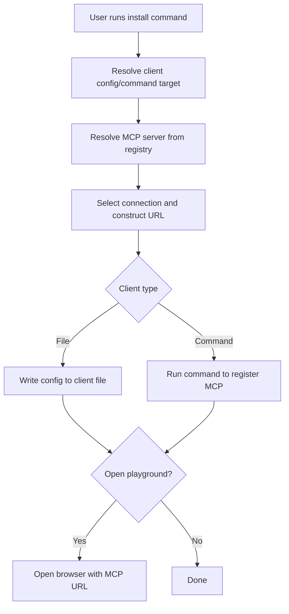

# MCP Server Installation Walkthrough (Smithery CLI)

This document provides an in-depth technical walkthrough of how the Smithery CLI handles the installation of an MCP server for a desktop client (e.g., Claude, Cursor, VS Code, etc.) via the `install` command. It covers the flow from command invocation to config file writing or command execution, referencing actual code and logic from the codebase.

---

## 1. Command Invocation (Generalized)

A typical install command looks like:

```sh
npx -y @smithery/cli@latest install <server> --client <client> --profile <profile> --key <key>
```

**Example for Claude:**
```sh
npx -y @smithery/cli@latest install @supabase-community/supabase-mcp --client claude --profile hidden-chickadee-6S5PBc --key 7ccc8402-4d6d-4d76-bd05-e75cbeede425
```

**Example for Cursor:**
```sh
npx -y @smithery/cli@latest install @supabase-community/supabase-mcp --client cursor --profile my-cursor-profile --key <api-key>
```

**Example for VS Code:**
```sh
npx -y @smithery/cli@latest install @supabase-community/supabase-mcp --client vscode --profile my-vscode-profile --key <api-key>
```

**Flags:**
- `--client`: Target desktop client (e.g., `claude`, `cursor`, `vscode`, etc.)
- `--profile`: Profile name for the MCP config
- `--key`: API key for the MCP server

---

## 2. Client Path/Target Resolution

The CLI determines how to "install" the MCP config for the target client. This is handled in `src/client-config.ts`:

```ts
const clientPaths: { [key: string]: ClientInstallTarget } = {
  claude: { type: "file", path: defaultClaudePath },
  cursor: { type: "file", path: path.join(homeDir, ".cursor", "mcp.json") },
  vscode: {
    type: "command",
    command: process.platform === "win32" ? "code.cmd" : "code",
  },
  // ... other clients
};
```

**Supported Client Examples:**
| Client Name      | Type     | Target Path/Command                                      |
|------------------|----------|---------------------------------------------------------|
| `claude`         | file     | `~/Library/Application Support/Claude/claude_desktop_config.json` |
| `cursor`         | file     | `~/.cursor/mcp.json`                                    |
| `vscode`         | command  | `code --add-mcp ...`                                    |
| `roocode`        | file     | `~/.config/roocode/mcp_settings.json`                   |
| `boltai`         | file     | `~/.boltai/mcp.json`                                    |

**Explanation:**
- The CLI maps the `--client` value to either a file path (for most clients) or a command (for some, like VS Code).
- This mapping is extensible and platform-aware.

---

## 3. Server Resolution

The CLI resolves the MCP server package and fetches its connection details from the registry. See `src/registry.ts`:

```ts
export const resolveServer = async (
  serverQualifiedName: string,
  apiKey?: string,
  source?: ResolveServerSource,
): Promise<ServerDetailResponse> => {
  // ...
  const smitheryRegistry = new SmitheryRegistry(options)
  const result = await smitheryRegistry.servers.get({
    qualifiedName: serverQualifiedName,
  })
  return result
}
```

**Explanation:**
- The CLI uses the registry to fetch details about the MCP server, including available connection types and deployment URLs.

---

## 4. Connection Selection and URL Construction

The CLI selects the appropriate connection (usually HTTP) and constructs the MCP endpoint URL, including the API key and profile. See `src/utils/url-utils.ts`:

```ts
export function createStreamableHTTPTransportUrl(
  baseUrl: string,
  apiKey: string,
  config: ServerConfig | Record<string, never>,
  profile: string | undefined,
): URL {
  const url = new URL(baseUrl)
  // ...
  if (config) {
    const configStr = JSON.stringify(config)
    url.searchParams.set("config", Buffer.from(configStr).toString("base64"))
  }
  if (profile) {
    url.searchParams.set("profile", profile)
  }
  url.searchParams.set("api_key", apiKey)
  return url
}
```

**Explanation:**
- The MCP endpoint URL is constructed with query parameters for the config, profile, and API key.

---

## 5. Config Installation: File vs Command

The CLI installs the MCP server config by either writing to a file or running a command, depending on the client type.

### a. File-based Clients (e.g., Claude, Cursor, BoltAI)

The CLI writes the MCP server config to the target client's config file. The structure typically looks like:

```json
{
  "servers": {
    "my-profile": {
      "url": "https://deployment.url/mcp",
      "api_key": "..."
    }
  }
}
```

**Code Example:**
```ts
import fs from 'fs';

const configPath = clientPaths[client].path;
const config = {
  servers: {
    [profile]: {
      url: mcpUrl,
      api_key: apiKey,
    },
  },
};
fs.writeFileSync(configPath, JSON.stringify(config, null, 2));
```

### b. Command-based Clients (e.g., VS Code)

For some clients, the CLI runs a command to register the MCP server:

```ts
const configTarget = clientPaths[client];
if (configTarget.type === "command") {
  const args = ["--add-mcp", JSON.stringify({
    name: profile,
    url: mcpUrl,
    api_key: apiKey,
  })];
  execFileSync(configTarget.command, args);
}
```

**Explanation:**
- For file-based clients, the config is written directly to disk.
- For command-based clients, the CLI invokes the appropriate command with arguments to register the MCP server.

---

## 6. (Optional) Playground/Deeplink

For some clients, the CLI can open a browser to a playground URL with the MCP server pre-connected. See `src/lib/browser.ts`:

```ts
export async function openPlayground(
  tunnelUrl: string,
  initialMessage?: string,
): Promise<void> {
  const playgroundUrl = `https://smithery.ai/playground?mcp=${encodeURIComponent(
    `${tunnelUrl}/mcp`,
  )}${initialMessage ? `&prompt=${encodeURIComponent(initialMessage)}` : ""}`
  // ... open in browser ...
}
```

**Explanation:**
- The CLI constructs a URL with the MCP endpoint and opens it in the browser for instant access.

---

## 7. Summary Flow Diagram



---

## 8. References
- `src/client-config.ts`: Client path/command resolution
- `src/registry.ts`: Server resolution
- `src/utils/url-utils.ts`: URL construction
- `src/lib/browser.ts`: Playground/deeplink logic

This process ensures that the MCP server is "installed" for the target client—regardless of whether it is file-based or command-based—by writing the correct config or invoking the appropriate command, enabling seamless integration and one-click access across a variety of desktop clients. 