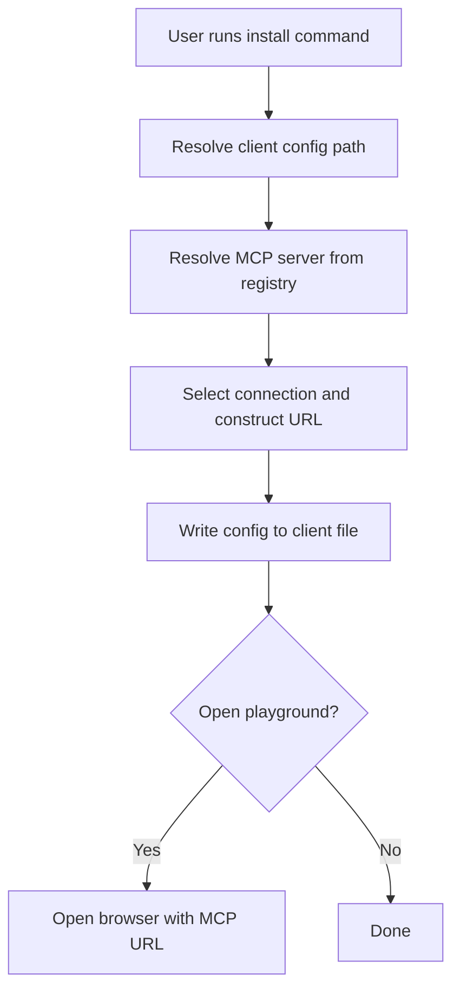

# MCP Server Installation Walkthrough (Smithery CLI)

This document provides an in-depth technical walkthrough of how the Smithery CLI handles the installation of an MCP server for a desktop client (e.g., Claude) via the `install` command. It covers the flow from command invocation to config file writing, referencing actual code and logic from the codebase.

---

## 1. Command Invocation

A typical install command looks like:

```sh
npx -y @smithery/cli@latest install @supabase-community/supabase-mcp --client claude --profile hidden-chickadee-6S5PBc --key 7ccc8402-4d6d-4d76-bd05-e75cbeede425
```

**Flags:**
- `--client`: Target desktop client (e.g., `claude`)
- `--profile`: Profile name for the MCP config
- `--key`: API key for the MCP server

---

## 2. Client Path Resolution

The CLI determines where to write the MCP config for the target client. This is handled in `src/client-config.ts`:

```ts
const platformPaths = {
  darwin: {
    baseDir: path.join(homeDir, "Library", "Application Support"),
    vscodePath: path.join("Code", "User", "globalStorage"),
  },
  // ... other platforms
};

const clientPaths: { [key: string]: ClientInstallTarget } = {
  claude: { type: "file", path: defaultClaudePath },
  // ... other clients
};

const defaultClaudePath = path.join(
  baseDir,
  "Claude",
  "claude_desktop_config.json",
);
```

**Explanation:**
- The CLI maps the `--client` value to a file path where the MCP config should be written.
- For `claude` on macOS, this is `~/Library/Application Support/Claude/claude_desktop_config.json`.

---

## 3. Server Resolution

The CLI resolves the MCP server package and fetches its connection details from the registry. See `src/registry.ts`:

```ts
export const resolveServer = async (
  serverQualifiedName: string,
  apiKey?: string,
  source?: ResolveServerSource,
): Promise<ServerDetailResponse> => {
  // ...
  const smitheryRegistry = new SmitheryRegistry(options)
  const result = await smitheryRegistry.servers.get({
    qualifiedName: serverQualifiedName,
  })
  return result
}
```

**Explanation:**
- The CLI uses the registry to fetch details about the MCP server, including available connection types and deployment URLs.

---

## 4. Connection Selection and URL Construction

The CLI selects the appropriate connection (usually HTTP) and constructs the MCP endpoint URL, including the API key and profile. See `src/utils/url-utils.ts`:

```ts
export function createStreamableHTTPTransportUrl(
  baseUrl: string,
  apiKey: string,
  config: ServerConfig | Record<string, never>,
  profile: string | undefined,
): URL {
  const url = new URL(baseUrl)
  // ...
  if (config) {
    const configStr = JSON.stringify(config)
    url.searchParams.set("config", Buffer.from(configStr).toString("base64"))
  }
  if (profile) {
    url.searchParams.set("profile", profile)
  }
  url.searchParams.set("api_key", apiKey)
  return url
}
```

**Explanation:**
- The MCP endpoint URL is constructed with query parameters for the config, profile, and API key.

---

## 5. Config File Writing

The CLI writes the MCP server config to the target client's config file. The structure typically looks like:

```json
{
  "servers": {
    "hidden-chickadee-6S5PBc": {
      "url": "https://deployment.url/mcp",
      "api_key": "7ccc8402-4d6d-4d76-bd05-e75cbeede425"
    }
  }
}
```

**Code Example:** (Pseudocode for writing config)
```ts
import fs from 'fs';

const configPath = clientPaths[client].path;
const config = {
  servers: {
    [profile]: {
      url: mcpUrl,
      api_key: apiKey,
    },
  },
};
fs.writeFileSync(configPath, JSON.stringify(config, null, 2));
```

---

## 6. (Optional) Playground/Deeplink

For some clients, the CLI can open a browser to a playground URL with the MCP server pre-connected. See `src/lib/browser.ts`:

```ts
export async function openPlayground(
  tunnelUrl: string,
  initialMessage?: string,
): Promise<void> {
  const playgroundUrl = `https://smithery.ai/playground?mcp=${encodeURIComponent(
    `${tunnelUrl}/mcp`,
  )}${initialMessage ? `&prompt=${encodeURIComponent(initialMessage)}` : ""}`
  // ... open in browser ...
}
```

**Explanation:**
- The CLI constructs a URL with the MCP endpoint and opens it in the browser for instant access.

---

## 7. Summary Flow Diagram



---

## 8. References
- `src/client-config.ts`: Client path resolution
- `src/registry.ts`: Server resolution
- `src/utils/url-utils.ts`: URL construction
- `src/lib/browser.ts`: Playground/deeplink logic

---

This process ensures that the MCP server is "installed" for the target client by writing the correct config, enabling seamless integration and one-click access. 